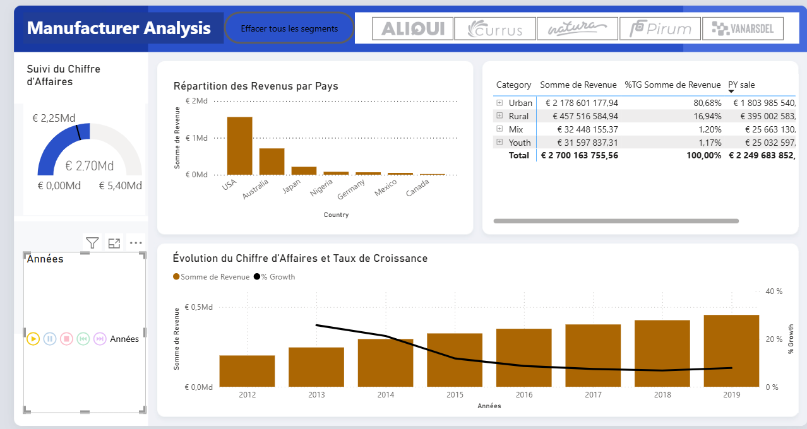

# Analyse-de-la-Performance-des-Fabricants
Ce projet présente un tableau de bord interactif Power BI conçu pour piloter la performance commerciale mondiale des fabricants. Il permet de suivre l'évolution du chiffre d'affaires, d'analyser la répartition géographique et sectorielle des ventes, et de mesurer dynamiquement la croissance annuelle par rapport à l'année précédente (Prior Year)

##  Fonctionnalités Clés & Analyses
* **Suivi de la Performance :** Visualisation du revenu total (€ 264,57M) comparé à l'année précédente (€ 213,88M) via une jauge dynamique.
* **Analyse Géographique :** Identification des marchés clés (USA, Australie, Japon...).
* **Segmentation Sectorielle :** Ventilation des ventes par catégorie (`Urban`, `Rural`, `Mix`, `Youth`) avec calcul de leur poids en pourcentage.
* **Analyse Temporelle :** Graphique combiné mettant en évidence l'évolution du volume de revenus et du taux de croissance (`% Growth`) de 2012 à 2019.

---

##  Stack Technique & Compétences Clés
* **Outil BI :** Power BI Desktop (Format de projet `.pbip`)
* **Modélisation :** Conception d'un modèle en étoile (faits et dimensions) avec table de dates.
* **Calculs DAX (Data Analysis Expressions) :**
    * Fonctions de *Time Intelligence* pour le calcul de l'année précédente (`PY sale`).
    * Calculs de ratios pour les taux de croissance globaux (`% Growth`).
* **Data Visualisation :** Design épuré, respect d'une charte graphique et filtres temporels dynamiques.

---

##  Aperçu du Dashboard

